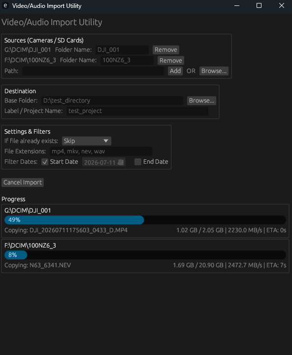

# import utility

a fast, multithreaded rust app for importing video/audio files from multiple sd cards or drives at once.

written with Gemini-3.1 Pro using Antigravity.



## features

- **multithreaded copying:** pulls from multiple sources at the same time to speed things up.
- **custom labels:** label your sources (like `cam_a`, `audio`) so they get sorted into their own subfolders in the target directory.
- **date filtering:** use a date picker to only import files between x and y dates.
- **custom extensions:** add or remove whatever file extensions you want to import directly in the ui.
- **persisted state:** it remembers your previous inputs when you close and open it again.
- **disk space check:** checks if your destination drive actually has enough space for the footage before it starts importing.
- **stats & eta:** shows real-time transfer speeds, storage used, and an eta for the copying.
- **conflict resolution:** handle duplicates by skipping, renaming, or overwriting.

## install

grab `import_utility.exe` from the releases page and run it, or build it yourself:

```bash
cargo build --release
```

it'll show up in `target/release/import_utility.exe`.

## how to use

1. type a name for your project (this creates a root folder at your destination).
2. pick your destination folder.
3. add your sources (sd cards, drives, etc).
4. label each source so it goes into the right subfolder.
5. tweak the file extensions or date filters if you need to.
6. hit start.

## default file types

it looks for these by default, but you can change them in the ui anytime:
- `mp4`
- `mkv`
- `nev`
- `wav`

## license
MIT
